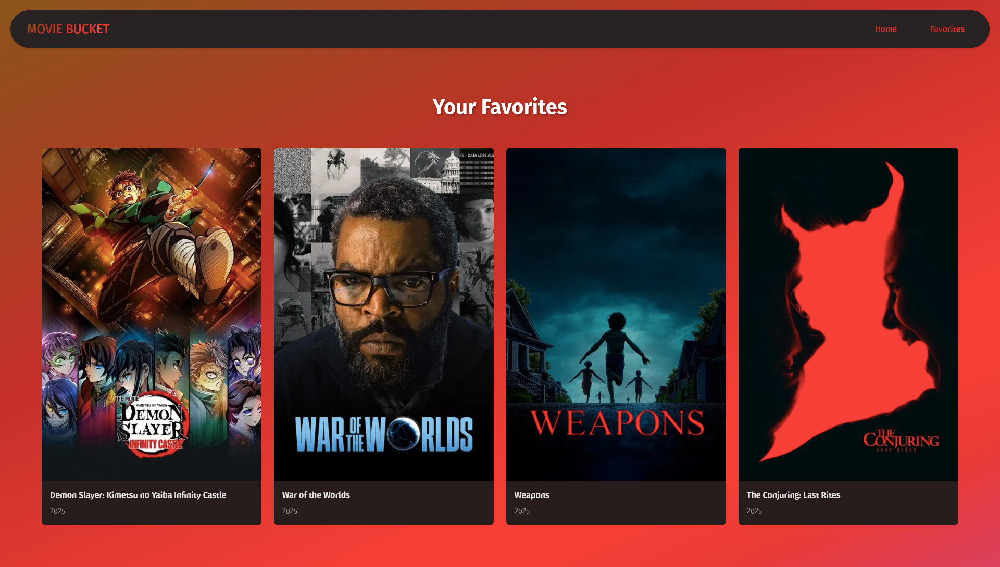

# Movie Bucket [Built with React-js]

### Project Live Link: https://movie-bucket-react.netlify.app/

### Project Preview
- Home Page


- Favorites Page



### Clone the Repository
```bash
git clone https://github.com/emonislive/movie-bucket-site.git
cd movie-bucket-site
```

### Install Dependencies
```bash
npm install
```

### Start the Development Server
```bash
npm run dev
```

### You will see a URL like:
- Local: http://localhost:5173
- Open this in your browser to view your project.

### Optional: Build for Production [for `Netlify` deploy]
- This creates a 'dist/' folder with optimized static files.
```bash
npm run build
```
### Optional: Preview the Production Build
```bash
npm run preview
```

### ⚠️ Important Disclaimer
- You must add your **TMDB API key** in the `API_KEY` variable inside `src/services/api.js`.
- TMDB provides free api, you do not need to pay for anything.
- Without it, the functions `getPopularMovies` and `searchMovies` will not return any data, and the app will not display movies.
